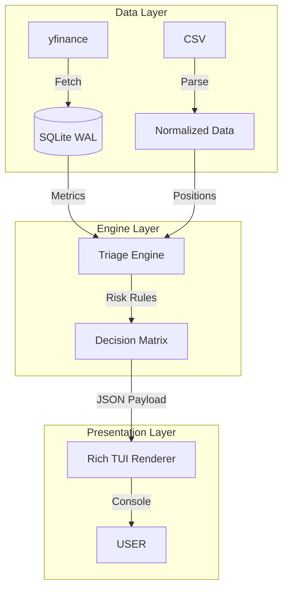

# Variance: Systematic Volatility Engine

[](https://www.python.org/) []() []()

Variance is a **Systematic Volatility Analysis Engine** for retail quants. It helps you identify statistical edges in the options market by synthesizing **Structural (252d)** and **Tactical (20d)** Volatility Risk Premia (VRP).

It operates on a strict **"Math, Not Narratives"** philosophy:
*   **Safety First:** "Strict Mode" filters reject low-quality or illiquid data automatically.
*   **Regime Aware:** Distinguishes between "Rich" (Expensive) and "Coiled" (Explosive) volatility regimes.
*   **Mechanical:** Automates portfolio triage based on probability, not P/L.

---

## ⚡ Quick Start

### 1. Installation
```bash
# Clone and Setup
git clone https://github.com/epj009/variance-yfinance.git variance
cd variance
python3 -m venv venv
source venv/bin/activate
pip install -r requirements.txt
```

### 2. Run the Engine
Drop your portfolio CSV into the `positions/` folder (or use the dummy data).

```bash
# Launch the HUD (Analysis + TUI)
./variance --tui
```

---

## 🚦 The Variance Workflow

The engine is designed around two core loops: **Defense (Triage)** and **Offense (Screener)**.

### 1. Portfolio Triage (The Shield)
The TUI organizes your positions into a unified priority tree.

*   **💰 HARVEST:** Profit > 50% (or high velocity win). **Action:** Close.
*   **🛡️ DEFENSE:** Tested strikes with < 21 DTE. **Action:** Roll or Manage.
*   **☢️ GAMMA:** Untested but < 21 DTE. **Action:** Close to avoid gamma risk.
*   **🐳 SIZE RISK:** Single position contributes > 5% of Net Liq to Tail Risk (-2SD).
*   **➕ SCALABLE:** VRP Surge detected in a small existing position. **Action:** Size up.
*   **⏳ HOLDING:** Healthy position. **Action:** Do nothing.

### 2. Volatility Screener (The Sword)
The screener ranks opportunities by **VRP Tactical Markup** (NVRP).

| Signal | Logic | Recommended Mechanic |
| :--- | :--- | :--- |
| **RICH** | VRP (T) > +20% | **Short Strangle / Naked Put** (Sell Premium) |
| **BOUND** | Compression < 0.75 | **Iron Condor** (Range Trade) |
| **DISCOUNT** | VRP (T) < -10% | **Calendar / Diagonal** (Buy Premium) |
| **EXPANDING** | HV20 > HV60 | **Trend Following** (Respect the move) |

---

## 📊 Dashboard & Metrics

### The "Data Quality" Gauge
Variance includes a dedicated safety system to prevent "Garbage In, Garbage Out."
*   **Strict Mode:** Symbols with partial data, zero volume, or excessive spreads are **hard-rejected**.
*   **Advisory:** A red banner appears if your CSV has unit errors (e.g., per-share Greeks vs total position).

### VRP Markup (Alpha-Theta)
We quantify the "Quality of Income" by adjusting raw time decay for the Volatility Risk Premium.
*   **Formula:** `Alpha-Theta = Raw Theta * (IV / HV)`
*   **Logic:** If IV (20%) > HV (15%), every $1.00 of Theta is statistically "worth" $1.33.

### Dynamic Tail Risk
The engine runs a "Crash Test" simulation on every refresh.
*   **Scenario:** -5% Crash, Vol Spike, etc. (Configurable in `trading_rules.json`).
*   **Metric:** The maximum drawdown from the worst-case scenario.

---

## 🛠️ CLI Reference

The `variance` launcher handles the pipeline orchestration.

| Command | Description |
| :--- | :--- |
| `./variance` | **Hybrid Mode (Default).** Runs the TUI analysis, then launches an interactive Gemini strategy session. |
| `./variance --tui` | **TUI Only.** Fast, deterministic dashboard. Best for quick checks. |
| `./variance --chat` | **Chat Only.** Launches the Gemini agent without running the analysis pipeline first. |

---

## ⚙️ Configuration

The engine's physics are defined in `config/trading_rules.json`.

```json
{
  "net_liquidity": 50000,
  "profit_harvest_pct": 0.50,
  "vrp_structural_threshold": 0.85,
  "vrp_scalable_threshold": 1.35,
  "stress_scenarios": [
    {"label": "Crash (-5%)", "move_pct": -0.05, "vol_point_move": 15.0}
  ]
}
```

---

## 🏗️ Architecture

Variance follows a strict **Model-View-Controller (MVC)** pattern for reliability.



*   **Resilience:** The data layer uses intelligent caching with dynamic TTL (short during market hours, long overnight).
*   **Precision:** Micro Futures (`/MES`, `/MNQ`) are correctly mapped and proxied.
*   **Auditability:** Every decision (Harvest, Defense) is logged with a specific reason code.

---

## ⚠️ Disclaimer
Variance is a research tool for quantitative analysis. It does not provide financial advice. Options trading involves significant risk of loss.
