# Variance: Systematic Volatility Engine

[](https://www.python.org/) []() []()

Variance is a **Systematic Volatility Analysis Engine** designed to identify statistical edges in the options market using purely open-source data (yfinance). It follows a strict **Layered Data Pipeline** architecture: CSV positions flow through ETL, analysis, and triage layers before reaching a terminal-first TUI. All trading thresholds are externalized to JSON configuration files, enabling quantitative reproducibility.

## 🚀 Key Features

*   **📡 Dual-VRP Synthesis**: Monitors both **Structural (252d)** and **Tactical (20d)** Volatility Risk Premia to find high-conviction trades.
*   **💎 Alpha-Theta Metrics**: Visualizes the "Quality of Income" by adjusting raw Theta for the current VRP markup (`Raw → Expected`).
*   **🧠 Strategist Workflow**: The Agent interprets mathematical states (e.g., "Bound") using the official Strategy Playbook and Mechanics documents.
*   **🛡️ Portfolio Triage**: Automatically flags positions based on unified probabilistic rules:
    *   `HARVEST`: Profit > 50%.
    *   `DEFENSE`: Tested strikes needing active management.
    *   `GAMMA`: Risk acceleration (< 21 DTE).
    *   `SIZE RISK`: Position contributes > 5% of Net Liq to Tail Risk (2SD-).
    *   `SCALABLE`: Fresh VRP surge detected in a small existing position.
    *   `TOXIC`: Negative expectancy (Expected Yield < Statistical Cost).
*   **🧪 Research Lab**: Includes institutional-grade utilities for Sector Z-Score analysis and Tactical/Structural divergence.
*   **⚫ Monochrome UI**: A distraction-free, high-contrast terminal interface.
*   **✨ Rich TUI**: Professional, color-coded panels and tables powered by the `rich` library.

## 🛠️ Architecture

```mermaid
graph TD
    subgraph "The World (Data)"
        YAHOO[yfinance API] -->|Market Data: IV, HV, Price| FETCH[scripts/get_market_data.py]
        BROKER[Broker CSV] -->|Positions| PARSER[scripts/portfolio_parser.py]
    end

    subgraph "The Engine (Analysis)"
        FETCH -->|Standardized Metrics| ENGINE[scripts/analyze_portfolio.py]
        PARSER -->|Normalized Rows| DETECTOR[scripts/strategy_detector.py]
        
        DETECTOR -->|Grouped Clusters| ENGINE
        
        subgraph "Triage Layer (scripts/triage_engine.py)"
            ENGINE -->|Cluster Context| TRIAGE
            TRIAGE -->|VRP & Alpha-Theta| VRP_LOGIC[Action Logic Gates]
            TRIAGE -->|EM Simulator| STRESS_LOGIC[Probabilistic Scenarios]
            
            VRP_LOGIC -->|Result| BADGES[💰 🛡️ ☢️ 💀 🌳 ➕]
            STRESS_LOGIC -->|Result| WHALE[🐳 SIZE RISK]
        end
        
        subgraph "Screener Layer (scripts/vol_screener.py)"
            FETCH -->|Watchlist Data| SCREENER
            SCREENER -->|VRP Divergence| RANKING[Ranking: VRP Tactical Markup]
            SCREENER -->|Sector Lookup| TAGGING[Asset Class Tagging]
        end
    end

    subgraph "The View (scripts/tui_renderer.py)"
        ENGINE -->|JSON Report| RENDERER
        RENDERER -->|Rich.Table & Panel| RICH_LIB[Rich Library]
        
        RICH_LIB -->|HUD| CAP[Capital Console]
        RICH_LIB -->|HUD| GYRO[Gyroscope & Engine]
        RICH_LIB -->|Visual| SPECTRO[Delta Spectrograph]
        RICH_LIB -->|Visual| PROB_BOX[Probabilistic Stress Box]
        RICH_LIB -->|List| TRI_TREE[Portfolio Triage Tree]
        RICH_LIB -->|List| VOL_TABLE[Flat Screener Table]
    end

    subgraph "The Strategist (AI Layer)"
        RICH_LIB -->|Rich Text| AGENT[Gemini CLI Agent]
        AGENT -->|Interpretation| PLAYBOOK[docs/STRATEGY_PLAYBOOK.md]
        AGENT -->|Rules| CONFIG[config/trading_rules.json]
        AGENT -->|Final Advice| USER[User]
    end
```



### Layered Architecture

| Layer | Module | Responsibility |
|-------|--------|----------------|
| **Presentation** | `tui_renderer.py` | Pure TUI formatting via `rich`. No business logic. |
| **Orchestration** | `analyze_portfolio.py` | Thin coordinator. Assembles data flow. |
| **Domain Logic** | `triage_engine.py`, `strategy_detector.py` | Business rules, risk triage, position clustering. |
| **Data Access** | `get_market_data.py`, `portfolio_parser.py` | API fetching, CSV parsing, SQLite caching (WAL mode). |
| **Configuration** | `config/*.json` | Externalized thresholds, stress scenarios, trading rules. |

**Data Flow:** `positions/*.csv` -> Parser -> Market Data Fetcher -> Triage Engine -> TUI Renderer -> Terminal

## 📊 Dashboard & Metrics Explained

### 1. VRP Markup (The "Bonus" Yield)
*   **Concept**: Not all Theta is created equal. Some theta is "cheap" (underpriced risk), and some is "rich" (overpriced risk).
*   **Formula**: `Alpha-Theta = Raw Theta * (IV / HV)`
*   **In Dashboard**: Displayed as `Theta: $42 → $52 (+24% VRP)`.
*   **Meaning**: A **+24%** markup means you are collecting 24% more premium than the realized movement of the stock justifies. You are statistically "winning" before the trade even moves.

### 2. Dynamic Tail Risk (The "Crash" Test)
*   **Concept**: The maximum dollar amount you would lose if the single worst-case scenario in your config occurred *today*.
*   **Behavior**: The engine runs every scenario in your Stress Box (e.g., "-5% Crash", "Vol Spike", "+10% Rally") and finds the floor.
*   **Status**:
    *   **Safe**: < 5% of Net Liq.
    *   **Loaded**: 5-15% of Net Liq (Capital is efficiently deployed).
    *   **Extreme**: > 15% of Net Liq (Danger zone).

### 3. The "Signal" Logic (Regime Detection)
The system synthesizes multiple metrics into a single "Signal" for the TUI:

| Signal | Meaning | Target Environment |
| :--- | :--- | :--- |
| **RICH** | High Tactical VRP (>+20%) | Undefined Risk (Strangles) |
| **BOUND** | Squeezed / Rangebound | Defined Risk (Iron Condors) |
| **DISCOUNT** | Underpriced Vol (<-10%) | Long Vol (Calendars/Diagonals) |
| **EVENT** | Binary event risk | Earnings (Avoid) |
| **FAIR** | Fairly priced risk | Pass |
| **TOXIC** | Theta Leakage (Alpha < Theta) | Exit / Recycle BPR |

*   **Absolute Scoring**: The system rewards **dislocation**, not just richness. A deep discount (cheap vol) surfaces at the top of the screener alongside rich vol, as both represent high-probability mean-reversion opportunities.

## ⚙️ Configuration & Customization

### The Stress Box (`config/trading_rules.json`)
You can define your own "nightmare scenarios" for the Tail Risk engine. The system supports both Percentage Moves (`move_pct`) and Standard Deviations (`sigma`).

```json
"stress_scenarios": [
    {"label": "Crash (-5%)", "move_pct": -0.05, "vol_point_move": 15.0},
    {"label": "Dip (-3%)", "move_pct": -0.03, "vol_point_move": 5.0},
    {"label": "Vol Crush", "move_pct": 0.0, "vol_point_move": -10.0}
]
```

### Trading Rules
Control the engine's physics:
*   `vrp_structural_threshold`: Level to trigger "Neutral" (Default: 0.85)
*   `vrp_tactical_cheap_threshold`: Level to trigger "Discount" (Default: -0.10)
*   `net_liquidity`: Your account size (used for risk sizing and Alpha calculations).
*   `profit_harvest_pct`: Target profit to trigger "HARVEST" (Default: 0.50).

## 🛡️ System Resilience

*   **Partial Data Mode**: If the market data provider fails to return Option Chains (IV) but returns Price/HV, the system gracefully downgrades. It will calculate P/L and Delta but flag the Volatility metrics as `0.0` (missing) to prevent false positives in the screener.
*   **Data Quality Safeguards (⚠️)**: Extreme IV readings (e.g. < 5% on a volatile stock) are flagged with a warning icon in the TUI. Portfolio-level metrics are **clamped** (Default: -50% to +100%) to prevent a single bad data point from skewing your total Alpha-Theta accounting.
*   **Weekend-Aware Caching (Dynamic TTL)**: Data fetched after 4:00 PM ET (M-Th) is automatically cached until 10:00 AM the next morning. Friday afternoon and weekend data is persisted until Monday at 10:00 AM, ensuring a stable environment for research without hitting API rate limits or processing unstable after-hours quotes.

## 🏁 Getting Started

### 🛠️ Installation

```bash
# 1. Clone the repository
git clone https://github.com/epj009/variance-yfinance.git variance
cd variance

# 2. Create virtual environment
python3 -m venv venv
source venv/bin/activate
pip install -r requirements.txt

# 3. (Optional) Set up Gemini CLI for the interactive Persona
#    (Required only if you want the AI trading assistant features)
mkdir -p .gemini
cp variance-system-prompt.md .gemini/GEMINI.md
```

## 📊 Dashboard Preview

Variance provides a high-fidelity terminal interface (TUI) for real-time portfolio triage and opportunity scanning.

```text
╭──────────────── THE CAPITAL CONSOLE ─────────────────╮
│ • Net Liq:  $50,000.00        • Open P/L: $1,110.00  │
│ • BP Usage: 38.1% (Deploy)    • Status:   Harvesting │
╰──────────────────────────────────────────────────────╯
╭────────────────────────────────────────────────────────────────────────────────────╮
│ THE GYROSCOPE (Risk)                         THE ENGINE (Exposure)                 │
│ • Tilt:      Neutral (0 Δ)                   • Downside:  $-3,541.08 (Crash (-5%)) │
│ • Theta:     $198.00 → $253.62 (+28% VRP)    • Upside:    $2,858.92 (Rally (+5%))  │
│ • Stability: 0.00 (Stable)                   • Mix:       🌍 Diversified           │
│                                              • Data Qual: 100% (Excellent)         │
╰────────────────────────────────────────────────────────────────────────────────────╯
                                                                                    
📊 DELTA SPECTROGRAPH (Portfolio Drag)                                              
                                                                                    
      1     SPY            ┃┃┃┃┃┃┃┃┃┃┃┃┃┃┃                                +12.50 Δ   
      2     /ES            ┃┃┃┃┃┃┃┃┃┃                                      -8.40 Δ   
      3     IWM            ┃┃┃┃┃┃                                          +5.20 Δ   
                                                                                    
📂 PORTFOLIO OVERVIEW
├── 🚨 ACTION REQUIRED (3)
│   ├── 💰 SPY (Iron Condor) $200.00 [HARVEST] 
│   │   └── 27 DTE: Profit 66.7% (Target: 50%)
│   ├── 🛡️ /ES (Short Strangle) $-800.00 [DEFENSE] 
│   │   └── 12 DTE: Tested & < 21 DTE
│   └── 🛡️ IWM (Short Put) $250.00 [GAMMA] 
│       └── 12 DTE: < 21 DTE Risk
```

To see this live on your machine, run:
```bash
./variance --demo
```

## 🚀 Usage

### 1. Portfolio Triage (Daily Routine)
```bash
./variance
```
*Wrapper script that finds the newest CSV in `positions/`, analyzes it, and launches the dashboard.*

### 2. Volatility Scanning
```bash
./venv/bin/python3 scripts/vol_screener.py
```
*Outputs a ranked list of opportunities with side-by-side VRP(S) and VRP(T) metrics.*

### 3. Quant Research Lab
```bash
python3 util/research_lab.py
```
*Deep-dive utility for Sector Z-Scores and Portfolio Alpha-Theta quality audit.*

## ⚠️ Disclaimer
Variance is a research tool for quantitative analysis. It does not provide financial advice. Trading options involves significant risk.