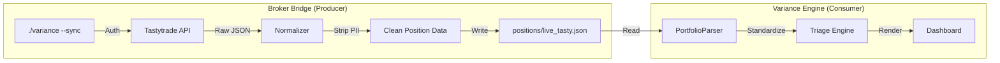

# RFC 006: The Broker Bridge (Live API Integration)

| Status | Proposed |
| :--- | :--- |
| **Author** | Variance (Quant Agent) |
| **Date** | 2025-12-21 |
| **Area** | Architecture / Data Ingestion |

## 1. Summary
This RFC proposes the **Broker Bridge**, a decoupled module designed to fetch live portfolio positions directly from broker APIs (starting with Tastytrade). It replaces the manual "Export to CSV" workflow with a simplified CLI command (`./variance --sync`), transforming Variance from a static analyzer into a near-real-time command center.

## 2. Motivation
The current workflow requires users to:
1.  Log in to their broker.
2.  Navigate to the portfolio tab.
3.  Export CSV.
4.  Move/rename the file to `positions/`.
5.  Run Variance.

This friction discourages "Trade Small, Trade Often" mechanics. A live sync enables:
*   **Reduced Friction:** One command to update state.
*   **Higher Accuracy:** API data eliminates CSV parsing errors (e.g., date formats).
*   **Real-Time Triage:** Instant feedback on fills and adjustments.

## 3. Architecture: "Fetch & Save"

To maintain system stability and deterministic behavior, we will **NOT** integrate API calls directly into the analysis engine. Instead, we will use a **Producer-Consumer** model via the file system.



### 3.1. The "Lingua Franca" (Standard JSON Schema)
All broker adapters must output a standardized JSON format. This decouples the engine from specific broker quirks.

```json
{
  "meta": {
    "source": "tastytrade",
    "fetched_at": "2025-12-21T14:30:00Z",
    "account_hash": "a1b2***" 
  },
  "positions": [
    {
      "root": "SPY",
      "symbol": "SPY   231215P00450000",
      "type": "option",
      "side": "short",
      "quantity": 1,
      "strike": 450.0,
      "expiration": "2023-12-15",
      "cost_basis": 250.00
    }
  ]
}
```

### 3.2. Components

#### A. The Adapter (`scripts/brokers/tasty.py`)
*   **Responsibility:** Authentication, API Polling, Raw Data Fetch.
*   **Authentication:** Uses `tastytrade-sdk` (if available) or direct REST calls. Expects `TASTY_USERNAME` and `TASTY_PASSWORD` (or Session Token) in environment variables.
*   **Output:** Raw API response object.

#### B. The Normalizer (`scripts/brokers/normalizer.py`)
*   **Responsibility:** Parsing proprietary strings into the "Lingua Franca."
*   **Critical Logic:**
    *   **OCC Parsing:** Robust regex to decode `SPY 231215P...`.
    *   **Future Root Mapping:** Mapping `/ESZ4` to `/ES` (reusing our robust `portfolio_parser.py` logic).
    *   **PII Stripping:** Explicitly removing Account Numbers, Names, and Emails before saving to disk.

#### C. The Consumer (`scripts/portfolio_parser.py`)
*   **Upgrade:** Update `PortfolioParser` to detect `.json` files.
*   **Logic:** If file is `.csv`, use CSV logic. If `.json`, load directly and validate against schema.

## 4. Operational Guidelines

### 4.1. Security First
*   **Credentials:** Never stored in code. Loaded via `.env` or system keyring.
*   **Session:** We do not implement auto-trading or order routing. **Read-Only Scope.**

### 4.2. Staleness Checks
The Analysis Engine will check the `fetched_at` timestamp in the JSON header.
*   **< 1 Hour:** Valid.
*   **> 1 Hour:** Warning (`[Stale Source File]`).
*   **> 24 Hours:** Error/Reject.

### 4.3. Market Data Separation
We will **continue to use legacy provider** for market data (IV, HV, Price) in Phase 1.
*   *Reason:* Keeps the "Analysis" layer independent of the "Position" layer. We don't want to rely on the broker for Greeks, as their models might differ from our standardized VRP calculations.

## 5. Implementation Steps

1.  **Dependencies:** Add `tastytrade-sdk` (optional) or `requests` to `requirements.txt`.
2.  **Module:** Create `scripts/brokers/`.
3.  **Prototype:** Build `tasty_sync.py` to authenticate and fetch raw positions.
4.  **Integration:** Update `variance` launcher to handle `--sync`.

## 6. Verdict
This architecture minimizes risk. If the API fails, the user can still use a CSV. The core engine remains pure, testable, and deterministic.
