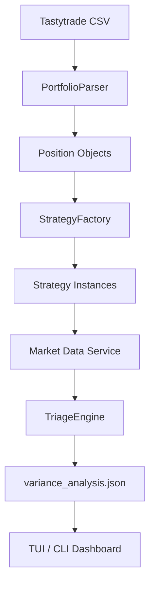

# Data Flow Pipeline

```mermaid
graph TD
    A[Tastytrade CSV] --> B[PortfolioParser]
    B --> C[Position Objects]
    C --> D[StrategyFactory]
    D --> E[Strategy Instances]
    E --> F[Market Data Service]
    F --> G[TriageEngine]
    G --> H[variance_analysis.json]
    H --> I[TUI / CLI Dashboard]
```
