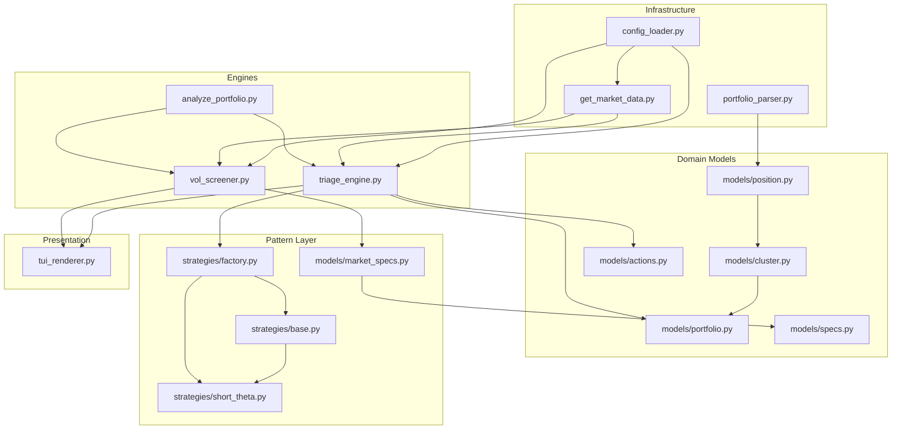

# Module Dependency Map

This diagram visualizes the relationships and data flow between the Variance Engine's core modules.

## Key Architectural Principles
1. **Unidirectional Flow:** Data moves from Ingest -> Domain -> Orchestration -> Presentation.
2. **Decoupled Mechanics:** Strategies (`ShortTheta`) are decoupled from the triage engine via the `StrategyFactory`.
3. **Modular Filtering:** Screener logic is decoupled from the search loop via the `Specification` pattern.
4. **Execution Isolation:** All actions flow through `ActionCommand` objects, which are read-only and lack execution capabilities.
