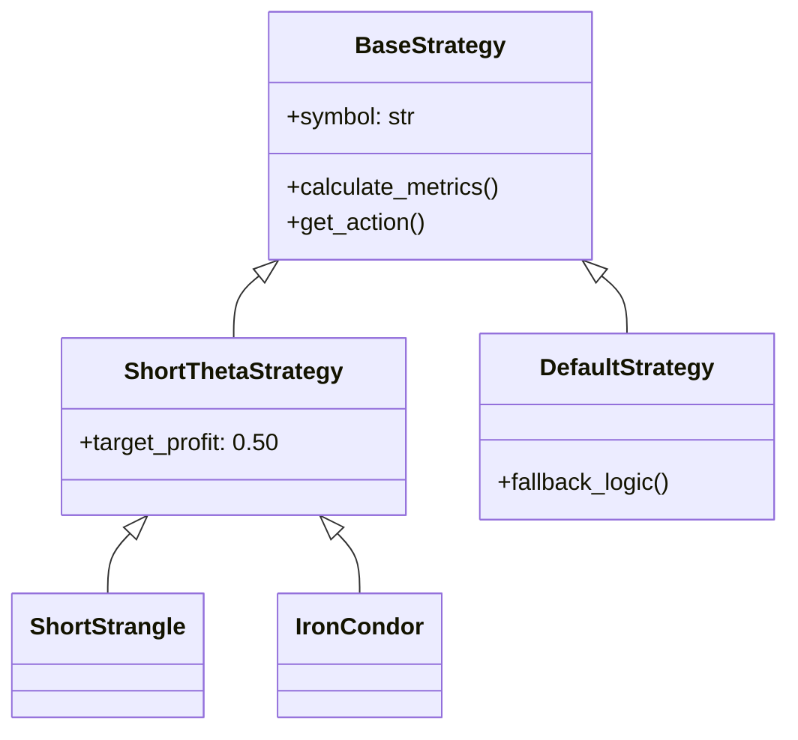

# Strategy Hierarchy

```mermaid
classDiagram
    class BaseStrategy {
        +symbol: str
        +calculate_metrics()
        +get_action()
    }
    class ShortThetaStrategy {
        +target_profit: 0.50
    }
    class DefaultStrategy {
        +fallback_logic()
    }
    BaseStrategy <|-- ShortThetaStrategy
    BaseStrategy <|-- DefaultStrategy
    ShortThetaStrategy <|-- ShortStrangle
    ShortThetaStrategy <|-- IronCondor
```
